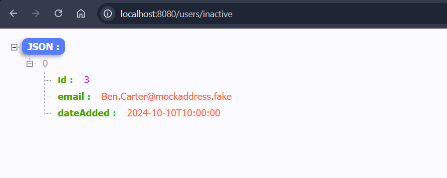
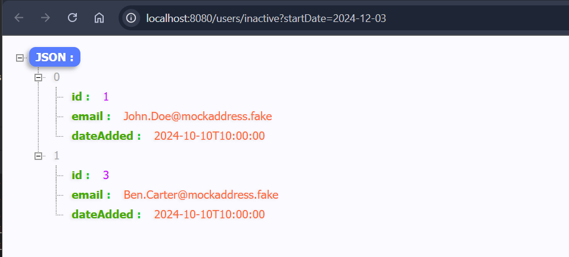

# document-analyzer

Open API yaml:

https://github.com/jerwine/document-analyzer/blob/main/spec/openapi.yaml

Schemas scripts:

https://github.com/jerwine/document-analyzer/blob/main/src/main/resources/db/migration/V1_1_1__DOCUMENTS_SCHEMA.sql

https://github.com/jerwine/document-analyzer/blob/main/src/main/resources/db/migration/V1_1_2__DOCUMENTS_SCHEMA.sql

https://github.com/jerwine/document-analyzer/blob/main/src/main/resources/db/migration/V1_1_3__DOCUMENTS_SCHEMA.sql

http://localhost:8080/h2-console

http://localhost:8080/users

http://localhost:8080/users/1

http://localhost:8080/users/inactive

http://localhost:8080/users/inactive?startDate=2024-12-03

http://localhost:8080/users/inactive?startDate=2024-11-11&endDate=2025-12-12

http://localhost:8080/users/inactive?endDate=2025-12-12

http://localhost:8080/documents

http://localhost:8080/documents/1

http://localhost:8080/documents/1/words-frequency

http://localhost:8080/documents/1/words-frequency?sort=desc&size=3

http://localhost:8080/documents/2/longest-word

